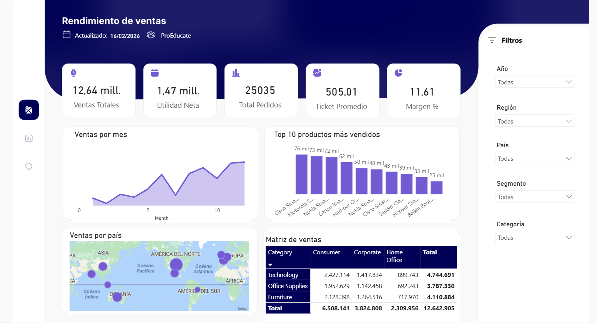

# Superstore Analysis

[Dashboard PowerBI](https://app.powerbi.com/view?r=eyJrIjoiNTQ2MTZmNTAtN2ZmNS00MWJmLTk2NzMtM2JiZDhjZWViNGM5IiwidCI6IjQwMDE5MDJmLWMxODYtNGQ3OS05ODkzLTc4ZmVkMTFjYmU4ZCIsImMiOjR9)

This project contains the analysis of the Superstore dataset, including data cleaning, feature engineering, and BI planning.

## Directory Structure

- `data/`: Contains raw and processed data.
- `notebooks/`: Jupyter notebooks for analysis.
- `sql/`: SQL scripts for database schema and queries.
- `powerbi/`: Power BI dashboard files.
- `docs/`: Project documentation.
- `etl/`: ETL scripts.
